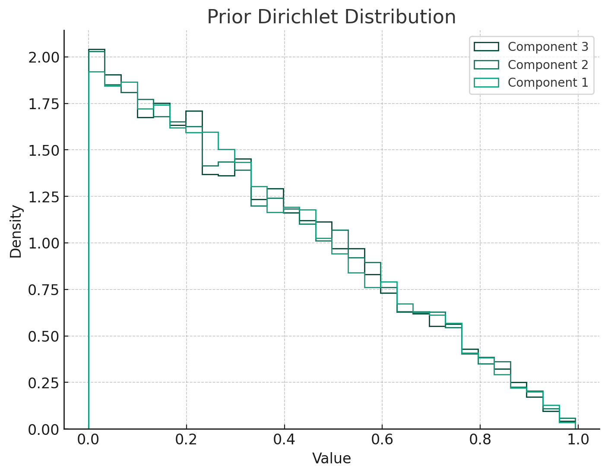
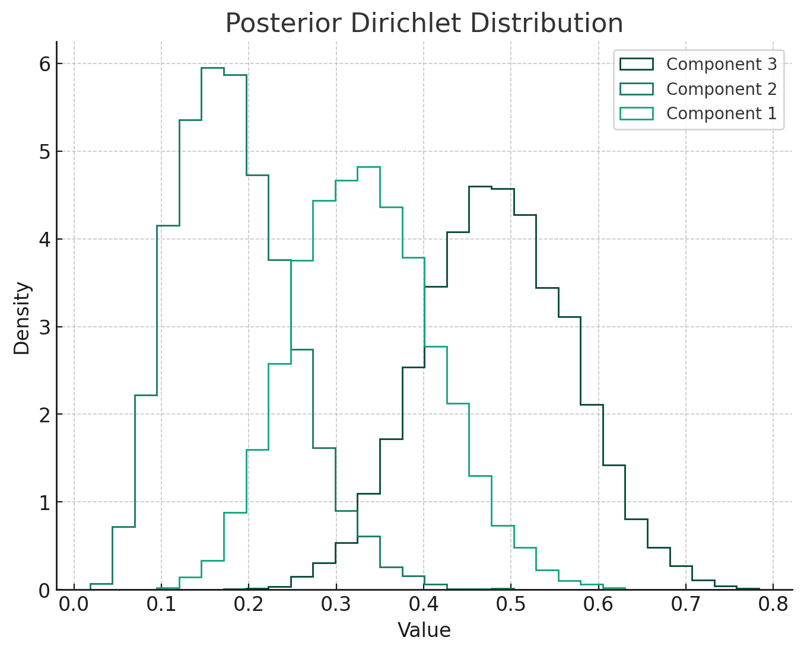
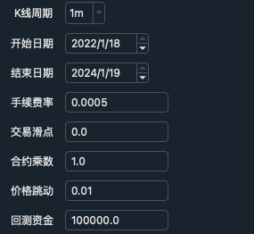
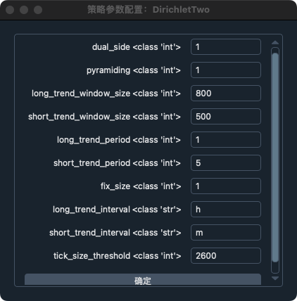
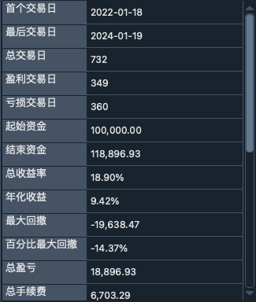
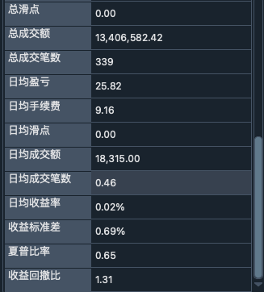
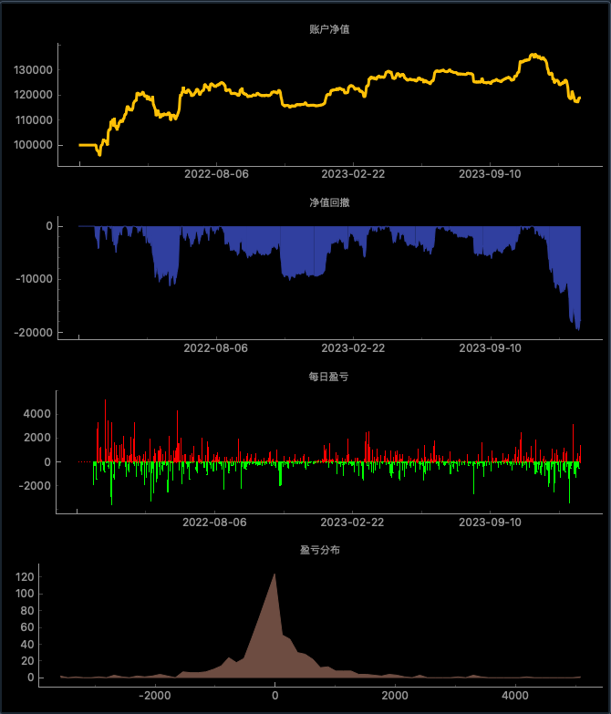
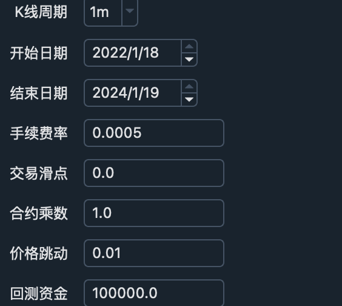
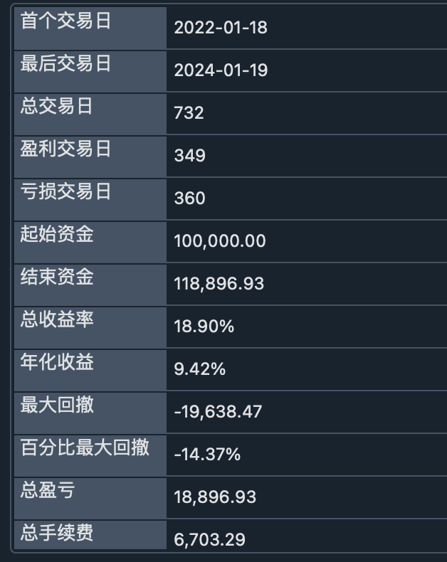
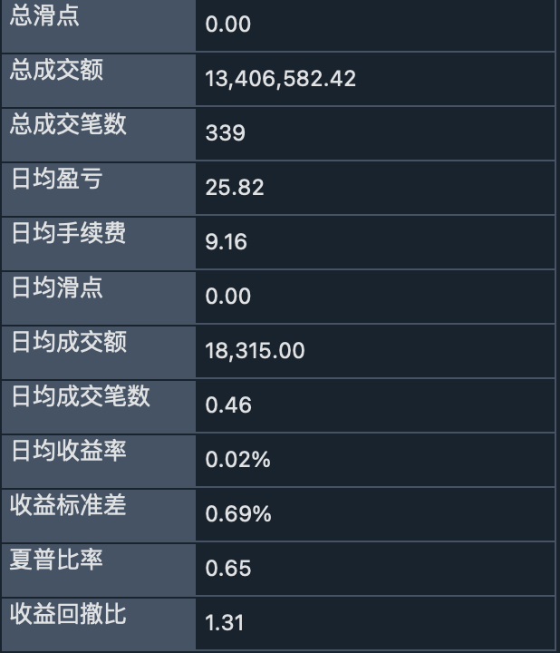

# 基于贝叶斯理论的交易策略 （三）

上一篇[文章](https://zhuanlan.zhihu.com/p/672525412)我们讲了利用Gamma-Poisson共轭分布来制定交易策略，以下这篇文章我们将尝试使用更加复杂的Dirichlet-Multinominal 共轭分布。

## 什么是Dirichlet分布

Dirichlet分布是由正实数向量参数化的一系列连续多元概率分布。 它经常在贝叶斯统计中用作多项分布的先验分布。 Dirichlet分布的概率密度函数的公式如下：

$$
P(\mathbf{x} \mid \boldsymbol{\alpha}) = \frac{1}{B(\boldsymbol{\alpha})} \prod_{i=1}^{K} x_i^{\alpha_i - 1}
$$

其中$\mathbf{x} = (x_1, \ldots, x_K)$是一个 K 维向量，表示 K 个不同类别或事件的概率。 这些概率之和必须为 1，

$\boldsymbol{\alpha} = (\alpha_1, \ldots, \alpha_K)$是一个正参数向量，$\alpha_i$代表了第$i$个类别的先验，或者说计数。

$\beta(\alpha)$是多项式Beta函数，作为归一化常数，保证总概率积分为1。定义为：$B(\boldsymbol{\alpha}) = \frac{\prod_{i=1}^{K} \Gamma(\alpha_i)}{\Gamma\left(\sum_{i=1}^{K} \alpha_i\right)}$，在这个公式中$\\Γ$表示Gamma函数，它是阶乘函数（其参数向下移动 1）到实数和复数的扩展。

Dirichlet分布是 Beta 分布向更高维度的推广。 在二维情况下（K=2），Dirichlet分布简化为 Beta 分布。

## 什么是Multinomial(多项分布)

多项分布是二项分布对两个以上类别的推广。 它描述了滚动 n 次 K 面骰子每一面可能计数的概率。 简单来说，它是固定次数试验中多个类别计数的分布。

**特点：**
1. 类别：有 K 种可能的结果或类别。
2. 试验：有 n 个独立试验。
3. 概率：每次试验都恰好产生 K 个类别中的一个。 每次试验的每个类别的概率都是固定的，并表示为：$p_1,p_2,\dots,p_k$，其中$∑p_i=1$

**Probability Mass Function**(PMF):
给定结果$x=(x_1,x_2,\dots,x_K)$的多项分布的pmf为：
$$P(X = x) = \frac{n!}{x_1! x_2! \ldots x_K!} p_1^{x_1} p_2^{x_2} \ldots p_K^{x_K}
$$
其中，$x_i$为$i$类别的计数，且$\sum^{K}_{i=1} x_{i}=n$。

## 共轭先验（Conjugate Prior）
在贝叶斯统计中，共轭先验是一种先验分布，当与某个似然函数结合时，会产生同一族的后验分布。 对于多项分布，共轭先验是Dirichlet分布。

原理：
**先验：** 在观察任何数据之前，我们使用Dirichlet分布（以参数为特征）表达我们对类别概率的信念，参数为$\boldsymbol{\alpha} = (\alpha_1,\alpha_2, \ldots, \alpha_K)$
**似然：** 然后我们观察可以建模为多项分布的数据。
**后验：** 观察数据后，类别概率的后验分布再次是Dirichlet分布，但具有更新的参数。

更新参数：
Dirichlet先验的参数根据观测数据以简单的方式更新。如果原本的参数为$\boldsymbol{\alpha} = (\alpha_1,\alpha_2, \ldots, \alpha_K)$，观测的计数为$x=(x_1,x_2,\dots,x_K)$，Dirichlet后验分布的参数即为：$\boldsymbol{\alpha} + x = (\alpha_1+x_1,\alpha_2+x_2, \ldots, \alpha_K+x_K)$

共轭先验的概念，如Dirichlet-multinomial，在贝叶斯分析中至关重要，因为它简化了后验分布的计算，而后验分布是贝叶斯推理的基础。 这种结合允许根据新数据对我们的信念进行更直接的分析或计算更新。

**Tips**
1.  **参数$\alpha_i$的含义**：
    
    *   当 $\alpha_i$​ 大于 1 时，表明对应的类别 $i$ 有较高的先验概率。
    *   当 $\alpha_i$​ 等于 1 时，表示对这些类别没有特别的先验知识，这称为无信息先验。
    *   当 $\alpha_i$ 小于 1 时，表明对应的类别 $i$ 有较低的先验概率。
2.  **概率的表达**：
    
    *   在 Dirichlet 分布中，$p_i$​ （第 $i$ 个类别的概率）的期望值是 $E[p_i]=\frac{\alpha_{i} }{\sum^{k}_{j} \alpha_{j} } $​。这表明 $\alpha_i$​ 影响了对应类别的概率，但不直接等同于概率。
3.  **贝叶斯更新**：
    
    *   在观察到数据后，Dirichlet 分布的参数会更新，形成后验分布。如果观察到的数据中类别 $i$ 出现的次数是 $x_i$​，则后验分布的参数变为 $\alpha_i+x_i$​。这意味着每个 $\alpha_i$​ 作为先验知识与观察到的数据相结合，共同影响了类别 $i$ 的后验概率。

因此，可以将每个 $\alpha_i$​ 看作是在没有观察数据之前对类别 $i$ 概率的一种"信念"或预期，而这些信念随着数据的出现而更新。这是贝叶斯方法的一个核心特点：结合先验信念和观察数据来形成后验知识。

## 参数更新可视化

* **先验Dirichlet分布**：此分布代表我们对不同结果的概率的最初信念（在 3 类示例中）。 在这里，我使用了统一先验参数 [1,1,1]，表示对任何类别没有初始偏好。

* **后Dirichlet分布**：观察数据后（在本例中，每个类别的 [10,5,15\]计数） ，后验分布更新了我们的信念。 后验分布的参数是先验参数与观察到的计数之和，得到参数 [11,6,16]。 这个后验分布现在反映了我们在考虑观察到的数据后更新的信念。


```python
import numpy as np
import matplotlib.pyplot as plt
from scipy.stats import dirichlet

# Function to plot Dirichlet distributions
def plot_dirichlet(parameters, title):
    # Sample from the Dirichlet distribution
    samples = dirichlet.rvs(parameters, size=10000)

    # Plotting
    plt.figure(figsize=(8, 6))
    plt.hist(samples, bins=30, density=True, histtype='step', label=['Component 1', 'Component 2', 'Component 3'])
    plt.title(title)
    plt.xlabel('Value')
    plt.ylabel('Density')
    plt.legend()
    plt.show()

# Prior Dirichlet distribution parameters (example values)
prior_parameters = np.array([1, 1, 1])
plot_dirichlet(prior_parameters, "Prior Dirichlet Distribution")

# Dirichlet-multinomial conjugation: updating the parameters
# Let's say we have observed counts for each category
observed_counts = np.array([10, 5, 15]) # example counts for 3 categories
posterior_parameters = prior_parameters + observed_counts
plot_dirichlet(posterior_parameters, "Posterior Dirichlet Distribution")

```

## 交易策略
在这种策略中，你可以使用长周期数据来设定先验参数，然后使用短周期数据来更新后验参数，从而做出交易决策。以下是一种实现这个策略的方法：

**步骤1：设定先验参数**
*   **选择长周期数据**：首先，你需要确定什么样的数据代表长周期。例如，这可以是过去一年的月度数据，或者任何其他符合你策略的历史数据。
*   **分析长周期数据**：根据这些数据，你可以估计每个类别（比如“看涨”，“看跌”，“中性”）的频率。
*   **设定Dirichlet先验参数**：使用这些频率来设定Dirichlet分布的先验参数$\boldsymbol{\alpha} = (\alpha_1,\alpha_2, \ldots, \alpha_K)$，这些参数反映了长周期市场行为的你的初始信念。

```python
    def on_long_bar(self, long_bar: BarData):
        self.am_long.update_bar(long_bar)
        if not self.am_long.inited:
            return

        # 计算看涨、看跌和中性的Bar数量
        for i in range(self.am_long.size):
            diff = self.am_long.close[i] - self.am_long.open[i]
            tick_diff = diff/self.tick_size
            if tick_diff > self.tick_size_threshold:
                self.prior_bullish += 1
            elif tick_diff < -self.tick_size_threshold:
                self.prior_bearish += 1
            else:
                self.prior_neutral += 1

        self.prior_neutral = self.prior_neutral/self.am_long.size
        self.prior_bearish = self.prior_bearish/self.am_long.size
        self.prior_bullish = self.prior_bullish/self.am_long.size

        self.priors_inited = True
```

**步骤 2: 更新后验参数**
*   **选择短周期数据**：接着，选择代表短周期的数据，例如最近一周或一个月的数据。
*   **计算类别计数**：统计短周期内每个类别的出现次数。
*   **更新后验参数**：使用短周期数据更新先验参数。如果你在短周期中观察到的类别计数为$(x_1,x_2,\dots,x_k)$，那么后验参数为$\boldsymbol{\alpha_{post}} + x = (\alpha_1+x_1,\alpha_2+x_2, \ldots, \alpha_K+x_K)$

```python
    def on_short_bar(self, short_bar: BarData):
        self.am_short.update_bar(short_bar)
        if not self.am_short.inited:
            return

        if not self.priors_inited:
            return

        buy_signal = False
        sell_signal = False

        bullish_count = 0
        bearish_count = 0
        neutral_count = 0

        # 计算看涨、看跌和中性的Bar数量
        for i in range(self.am_short.size):
            diff = self.am_short.close[i] - self.am_short.open[i]
            tick_diff = diff/self.tick_size
            if tick_diff > self.tick_size_threshold:
                bullish_count += 1
            elif tick_diff < -self.tick_size_threshold:
                bearish_count += 1
            else:
                neutral_count += 1

        # 更新参数
        self.post_bullish = self.prior_bullish + bullish_count
        self.post_bearish = self.prior_bearish + bearish_count
        self.post_neutral = self.prior_neutral + neutral_count

```

**步骤 3: 做出交易决策**

*  **计算后验均值**：计算每个类别的后验概率，$\alpha_{jpost} = \frac{\alpha_{jpost} }{\sum^{k}_{i} a_{ipost}} $
*  **选择概率最高的类别**：基于后验均值，确定哪个类别具有最高的概率。
*  **制定交易策略**：根据概率最高的类别制定你的交易策略。例如，如果“看涨”类别的概率最高，你可能会选择买入；如果是“看跌”，则可能会选择卖出。

```python
sumpost = self.post_bearish+self.post_neutral+self.post_bullish

        post_prob_bull = self.post_bullish/sumpost
        post_prob_bear = self.post_bearish/sumpost
        post_prob_neu = self.post_neutral/sumpost


        maxValue = max(post_prob_neu,post_prob_bull,post_prob_bear)

        if maxValue == post_prob_bear:
            sell_signal = True
        elif maxValue == post_prob_bull:
            buy_signal = True
        else:
            return

        if self.dual_side:
            if buy_signal and sell_signal:
                return
            # both long and short
            if buy_signal:
                if self.pos >= 0:
                    if abs(self.pos) < self.pyramiding:
                        self.buy(short_bar.close_price, self.fix_size)
                else:
                    self.cover(short_bar.close_price, abs(self.pos))
                    self.buy(short_bar.close_price, self.fix_size)

            if sell_signal:
                if self.pos <= 0:
                    if abs(self.pos) < self.pyramiding:
                        self.short(short_bar.close_price, self.fix_size)
                else:
                    self.sell(short_bar.close_price, abs(self.pos))
                    self.short(short_bar.close_price, self.fix_size)

        else:
            if buy_signal:
                if self.pos >= 0 and self.pos < self.pyramiding:
                    self.buy(short_bar.close_price, self.fix_size)

            if sell_signal:
                if self.pos != 0:
                    self.sell(short_bar.close_price, self.pos)


```

## 策略实战
**环境参数**

**策略参数**

**回测结果**


**策略曲线**





