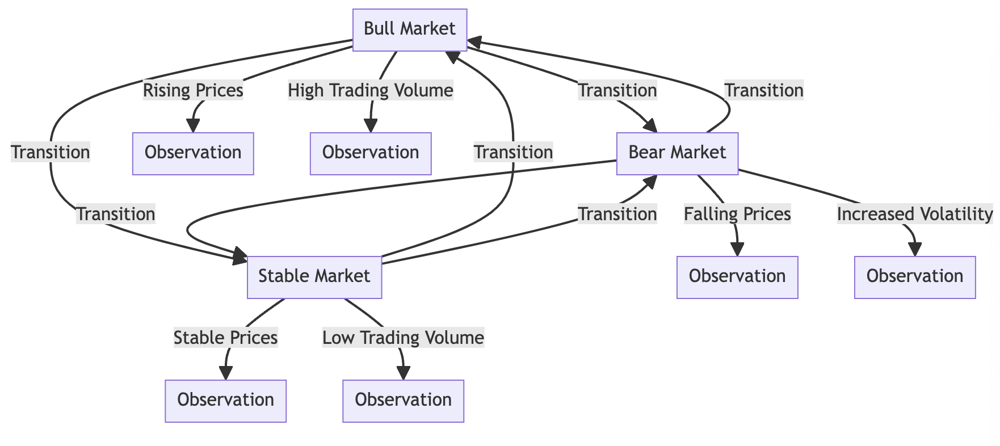
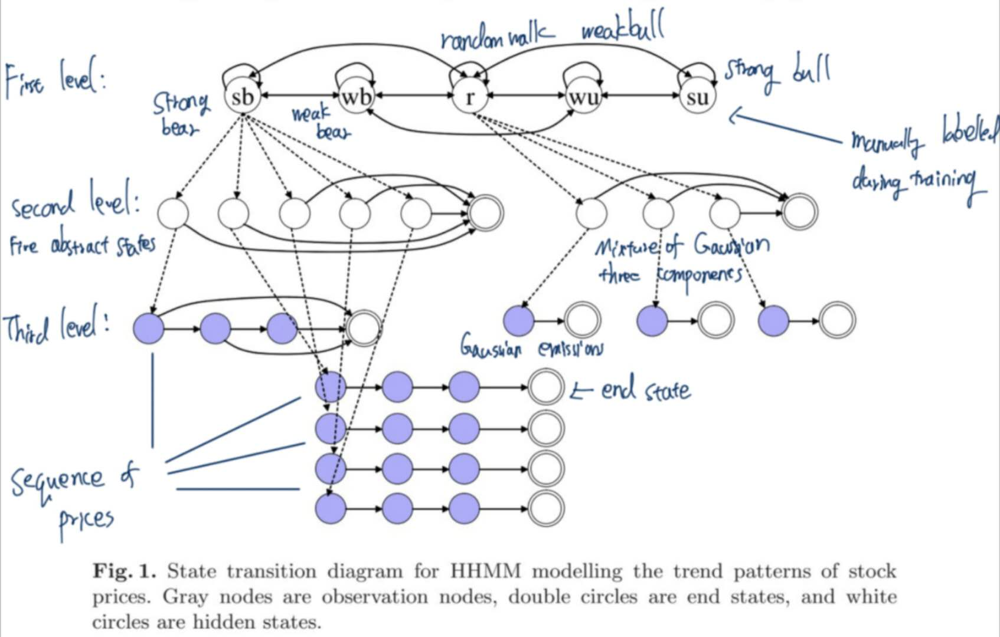
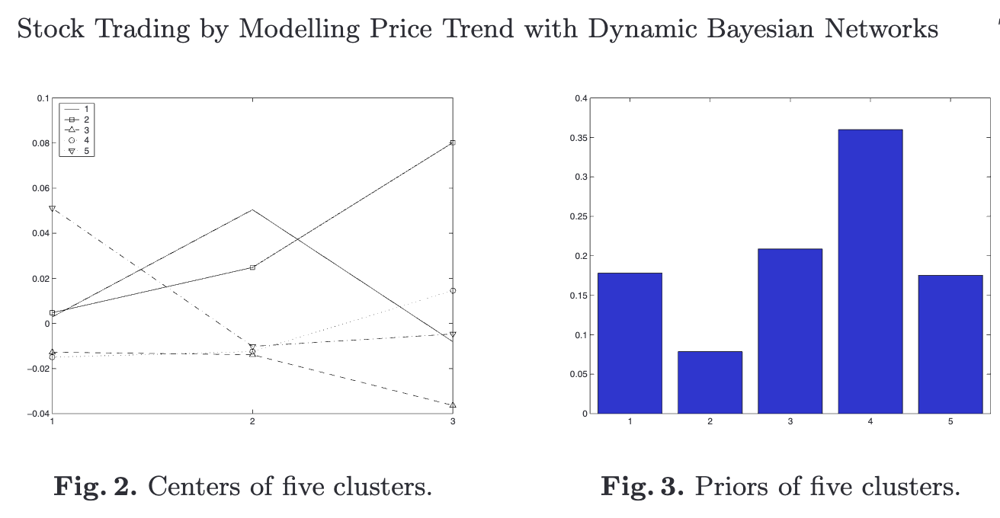
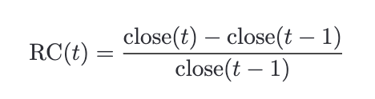
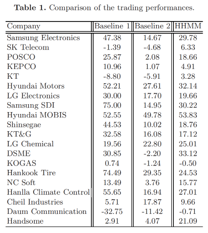
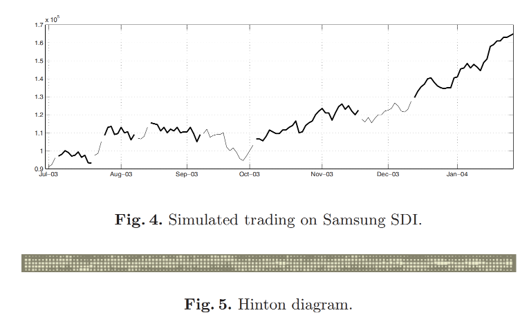
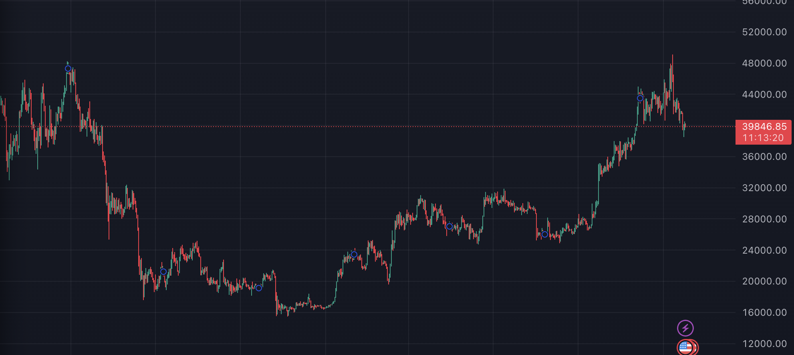

# DynamicBayesianTrading

## Intuition

- The behavior of the stock market is changing overtime, it's not a stationary process.
  Approach: Using a temporal model (a model that evolves over time)
- The suitable model(hierarchical hidden markov model)
  

### The relationship between a HHMM and DBN

A Hidden Markov Model (HMM) is a special type of Bayesian Network (BN) called a Dynamic Bayesian Network (DNB). A HMM may be represented in either matrix form for computation for as a graph for understanding the states and transitions. A DBN is a BN used to model time series data and can be used to model a HMM.

We can use the same parameter estimation as DBN such as EM algorithm.

Given a sequence of lengthT,the original inference algorithm for HHMM wasO(T3) which is prohibitive when long sequences. Fortunately, there is an efficient techniques to convert HHMM to DBN allowing O(T) inference time as usual DBN. Figure 1 is an HHMMfor mining trend patterns of stock prices which is designed in this paper.

## The diagram of the model

## parameter estimating

### two task

1. task 1
   We have only observations and we want to estimate the parameters such as transitional probabilities.
   we use EM(Expectation maximization) alogrithm to estimate the parameters.
2. task 2
   We have observations and parameters, we want to know what's the best possible hidden states. We use a dynamic programming algorithm Viterbi.

To train our HHMM model, we adapt a semi-supervised learning techniques.Rather than learning HHMM from only observed RC sequences, we manually labelled the hidden states in the first level. We consider in this paper the trend as the interval to which the gradient of moving average of future price including current price belongs. Moving average (MA) is defined as:

where i is the i-th day and W is the length of window to be considered. The trend of i-day is labelled to one of five hidden states according to the gradient of the moving average line. Using the labelled data, the HHMM is trained by EM algorithm for dynamic Bayesian Networks.

### semi-supervised learning

Combination of Labeled and Unlabeled Data:
Semi-supervised learning uses both labeled and unlabeled data. The labeled data is used as in supervised learning, while the unlabeled data is handled using techniques from unsupervised learning (like the Baum-Welch algorithm).

Parameter Initialization:
The parameters (transition, emission, and initial state
probabilities) are first initialized using the labeled data, following the same process as in supervised learning.

## Experiment

### The trading strategy

We take a bid signal if the sum of probabilities of su and wu gets greater than 0.5.
A ask signal if the sum for sb and wb gets lower than 0.5.

|             | probability > 0.5 | market probability < 0.5 |
| :---------- | :---------------: | -----------------------: |
| p(su)+p(wu) |        bid        |                     hold |
| p(sb)+p(wb) |       hold       |                      ask |

Baseline 1:
Imaginary profit as if we would hold a stock during entire test period.

Baseline 2: Cumulative profit when we use TRIX, a technical indicator, of which gold cross is used as bid signal and dead cross is used as ask signal.

## practice

period: 2022-1-18 ~ 2024-1-18
Market profit: $(42737-42576)/42576 = 0.38\%$

