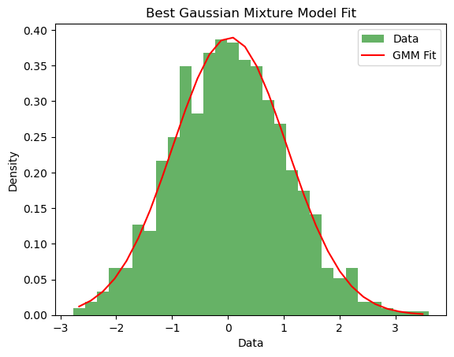
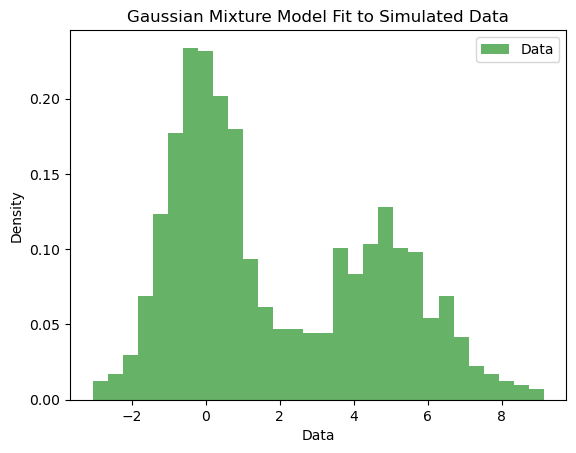
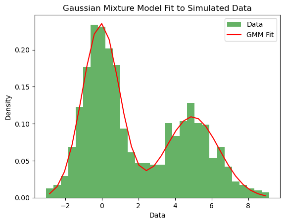
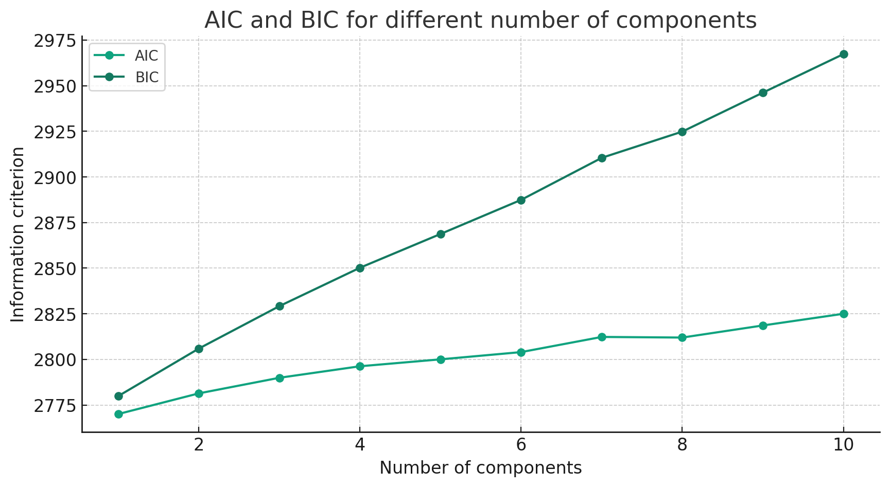

# 基于贝叶斯理论的交易策略（四）

前几期的文章都是用共轭先验分布来制定交易策略，本期文章将采用非共轭分布来制定交易策略。
一般情况下我们用正太分布可以拟合大部分类型的数据：


但现在我们不想假设先验分布属于什么分布，我们想利用数据本身直接得出一个分布，类似于无监督学习。
我们的分布可以是一个曲线比如：

对于这种非钟形曲线，我们可以利用Gaussian mixture distribution去拟合。

Gaussian mixture distribution 即是不同参数的高斯分布相加在一起，一般情况下，复杂的数据需要的Gaussian mixture component不会超过5就能达到比较好的效果，我们可以利用AIC和BIC来筛选合适的component数量。
以下是一个python例子：

```python
from sklearn.mixture import GaussianMixture
import numpy as np
import matplotlib.pyplot as plt

# 生成示例数据，这里直接使用正态分布的随机数据
data = np.random.normal(0, 1, 1000).reshape(-1, 1)

# 尝试不同的组件数量，以找出最佳的模型
n_components_range = range(1, 11)
models = [GaussianMixture(n, covariance_type='full', random_state=0).fit(data) for n in n_components_range]

# 计算每个模型的AIC和BIC
aics = [m.aic(data) for m in models]
bics = [m.bic(data) for m in models]

# 绘制AIC和BIC图表，以选择最佳的组件数量
plt.figure(figsize=(10, 5))

plt.plot(n_components_range, aics, label='AIC', marker='o')
plt.plot(n_components_range, bics, label='BIC', marker='o')
plt.xlabel('Number of components')
plt.ylabel('Information criterion')
plt.legend()
plt.title('AIC and BIC for different number of components')
plt.show()

# 找出AIC和BIC最小值对应的组件数量
best_aic_n_components = n_components_range[np.argmin(aics)]
best_bic_n_components = n_components_range[np.argmin(bics)]

(best_aic_n_components, best_bic_n_components)

```
运行结果：


可以看出，只由一个